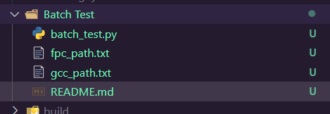

# 脚本名称

这个脚本用于处理C和Pascal代码，并比较它们的输出文件。

## 用法
1. 将fpc的路径放入`fpc_path.txt`文件中
2. 将gcc的路径放入`gcc_path.txt`文件中
3. 根据提示输入对应的路径

## 文件夹结构

确保以下文件夹位于与脚本相同的目录中：
1. 必须有`fpc_path.txt`文件和`gcc_path.txt`文件

## 依赖项

- Python 3.x
- GCC（用于编译C代码）
- Free Pascal（用于编译Pascal代码）

确保系统中已安装了以上依赖项，并将GCC和Free Pascal添加到系统路径中。

## 注意事项

- 确保在运行脚本之前正确设置文件夹路径。
- 确保代码文件、输入文件和输出文件的命名一致性。
- 如果发生错误，请检查错误消息以获取详细信息。